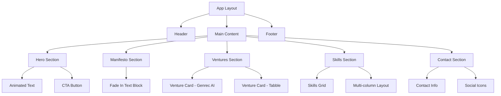

# Jai Samyukth Personal Portfolio Website Design Document

## Overview

This document outlines the design and architecture for a visually stunning, SEO-optimized personal portfolio website for Jai Samyukth. The website will showcase his ventures, skills, and professional philosophy through a minimalist, futuristic aesthetic inspired by the "Nothing" brand's design language.

### Project Vision
- **Aesthetic**: "The Ghost Aesthetic" - premium, minimalist, confident, and architectural
- **Experience**: Single-page scroll with sophisticated animations and smooth interactions
- **Performance**: Maximum SEO optimization and loading speed
- **Brand Identity**: Founder-focused portfolio emphasizing intelligent software architecture and sophisticated design

## Technology Stack & Dependencies

### Core Framework
- **Next.js 14** (App Router) with Static Site Generation (SSG)
- **TypeScript** for type safety and developer experience
- **TailwindCSS** for utility-first styling

### Animation Libraries
- **Framer Motion** - UI state transitions and component animations
- **GSAP with ScrollTrigger** - Complex scroll-linked and timeline-based animations
- **Lenis** - Smooth physics-based scroll experience

### SEO & Performance
- **Next.js Image** component for optimized images
- **next-sitemap** for automatic sitemap generation
- **JSON-LD** structured data implementation

### Deployment
- **Vercel** platform for seamless deployment and hosting

## Component Architecture

### Component Hierarchy



### Component Definitions

#### Core Layout Components

**AppLayout Component**
- Manages global animations and scroll behavior
- Integrates Lenis smooth scroll
- Handles viewport detection for mobile responsiveness

**ScrollAnimationProvider**
- Wraps application with GSAP ScrollTrigger context
- Manages animation timelines and triggers
- Provides animation utilities to child components

#### Section Components

**HeroSection**
- Implements mask animation for headline text reveal
- Features architectural typography with serif headings
- Contains primary CTA button with hover effects

**ManifestoSection**
- Scroll-triggered fade-in animation
- Typography-focused design with generous spacing
- Responsive text scaling for different viewports

**VenturesSection**
- Grid layout for venture cards
- 3D tilt and fade animations on scroll
- Hover effects with golden border glow

**SkillsSection**
- Multi-column responsive layout
- Categorized skill groups with visual hierarchy
- Animated skill category reveals

**ContactSection**
- Clean contact information display
- Animated social media icons
- Hover states with subtle transformations

#### Interactive Components

**VentureCard**
- 3D transform effects on hover
- Golden accent border animations
- Structured content display for company information

**AnimatedButton**
- Sophisticated hover animations
- Golden accent color integration
- Smooth state transitions

**SocialIcon**
- Clean, minimal icon design
- Hover animations with color transitions
- External link handling

### Props/State Management

#### Global State
- **Scroll Position**: Managed by Lenis for smooth scrolling
- **Animation States**: GSAP timeline management
- **Viewport Detection**: Responsive behavior handling

#### Component Props

**VentureCard Props**
```typescript
interface VentureCardProps {
  title: string;
  role: string;
  description: string;
  animationDelay?: number;
}
```

**AnimatedText Props**
```typescript
interface AnimatedTextProps {
  text: string;
  variant: 'hero' | 'heading' | 'body';
  animationType: 'mask' | 'fade' | 'slide';
  delay?: number;
}
```

**Section Props**
```typescript
interface SectionProps {
  id: string;
  className?: string;
  children: React.ReactNode;
  animationTrigger?: string;
}
```

### Lifecycle Methods/Hooks

#### Animation Hooks

**useScrollAnimation**
- Initializes GSAP ScrollTrigger for section
- Manages animation lifecycle
- Cleanup on component unmount

**useHoverEffect**
- Manages hover state animations
- Provides smooth enter/exit transitions
- Optimized for performance

**useSmoothScroll**
- Integrates Lenis smooth scroll
- Handles scroll-to-section functionality
- Manages scroll position state

## Styling Strategy

### Design System

#### Color Palette
- **Background**: Deep velvet-black (#0A0A10)
- **Primary Text**: Crisp off-white (#EAEAEA)
- **Accent**: Burnished Gold (#D4AF37)
- **Secondary**: Subtle gray variations for depth

#### Typography Scale
- **Hero Headlines**: Playfair Display (Serif, 3.5rem - 6rem)
- **Section Headings**: Playfair Display (2rem - 3rem)
- **Body Text**: Inter (1rem - 1.25rem)
- **Labels**: Inter (0.875rem)

#### Spacing System
- **Sections**: 8rem vertical spacing
- **Content**: 2rem - 4rem internal spacing
- **Elements**: 1rem - 2rem component spacing
- **Fine details**: 0.5rem micro-spacing

### TailwindCSS Configuration

#### Custom Theme Extensions
```javascript
// tailwind.config.js custom values
theme: {
  extend: {
    colors: {
      'ghost-black': '#0A0A10',
      'ghost-white': '#EAEAEA',
      'ghost-gold': '#D4AF37'
    },
    fontFamily: {
      'display': ['Playfair Display', 'serif'],
      'body': ['Inter', 'sans-serif']
    },
    animation: {
      'fade-up': 'fadeUp 0.8s ease-out forwards',
      'mask-reveal': 'maskReveal 1.2s ease-out forwards'
    }
  }
}
```

#### Component Classes
- **Container**: Max-width constraints with responsive padding
- **Section**: Consistent spacing and scroll trigger setup
- **Card**: Floating element styles with subtle shadows
- **Button**: Premium interaction states

### Animation Implementation

#### Framer Motion Variants
```javascript
const fadeUpVariants = {
  hidden: { opacity: 0, y: 30 },
  visible: { opacity: 1, y: 0, transition: { duration: 0.8 } }
};

const cardHoverVariants = {
  rest: { scale: 1, rotateX: 0 },
  hover: { scale: 1.02, rotateX: 5, transition: { duration: 0.3 } }
};
```

#### GSAP Timeline Configurations
- **Hero Text Reveal**: Mask animation with staggered character reveals
- **Section Transitions**: Scroll-triggered fade and slide animations
- **Card Interactions**: 3D transform effects on hover and scroll
- **Button States**: Smooth color and scale transitions

## Routing & Navigation

### Single Page Application Structure
- **Route**: `/` (Single page with scroll navigation)
- **Sections**: Scroll-to anchor navigation
- **Hash Navigation**: URL fragments for section linking

### Navigation Behavior
- **Smooth Scroll**: Lenis integration for physics-based scrolling
- **Section Detection**: Active section highlighting
- **Mobile Navigation**: Responsive menu for smaller viewports

## API Integration Layer

### Static Data Management
- **Content**: Hardcoded in component files for SSG optimization
- **Images**: Static assets with Next.js Image optimization
- **Metadata**: Structured data for SEO

### SEO Implementation

#### Metadata Configuration
```typescript
export const metadata: Metadata = {
  title: 'Jai Samyukth - Software Architect & Product Visionary',
  description: 'Architecting intelligent software and sophisticated digital experiences. Privacy-focused AI systems and minimalist, luxury-grade user interfaces.',
  keywords: ['Software Architecture', 'AI Systems', 'Product Design', 'Full-Stack Development'],
  authors: [{ name: 'Jai Samyukth' }],
  openGraph: {
    title: 'Jai Samyukth - Software Architect',
    description: 'Building privacy-focused AI systems and luxury-grade interfaces',
    type: 'website',
    url: 'https://jaisamyukth.com'
  }
};
```

#### Structured Data (JSON-LD)
```json
{
  "@context": "https://schema.org",
  "@type": "Person",
  "name": "Jai Samyukth",
  "jobTitle": "Software Architect & Product Visionary",
  "description": "Co-founder of Genrec AI and Founder of Tabble",
  "email": "jaisamyukth@gmail.com",
  "knowsAbout": ["Software Architecture", "AI Systems", "Product Design"],
  "worksFor": [
    {
      "@type": "Organization",
      "name": "Genrec AI",
      "description": "Privacy-first AI-powered solutions"
    },
    {
      "@type": "Organization", 
      "name": "Tabble",
      "description": "Ultra-luxury dining and hotel management platform"
    }
  ]
}
```

## Testing Strategy

### Testing Framework
- **Jest** for unit testing
- **Testing Library** for component testing
- **Playwright** for end-to-end testing

### Testing Areas

#### Component Testing
- **Animation States**: Verify animation triggers and completions
- **Responsive Behavior**: Test component rendering across viewports
- **Interaction States**: Validate hover and click behaviors

#### Performance Testing
- **Core Web Vitals**: LCP, FID, CLS measurements
- **Bundle Size**: JavaScript and CSS optimization validation
- **Image Loading**: Lazy loading and optimization verification

#### SEO Testing
- **Metadata Validation**: Verify all meta tags are properly set
- **Structured Data**: JSON-LD schema validation
- **Accessibility**: ARIA labels and semantic HTML structure

### Animation Testing
- **GSAP Animations**: Verify timeline execution and cleanup
- **Framer Motion**: Test component mount/unmount animations
- **Scroll Behavior**: Validate Lenis smooth scroll integration

## Content Structure

### Section Content Mapping

#### Hero Section
```typescript
const heroContent = {
  headline: "Architecting Intelligent Software and Sophisticated Digital Experiences.",
  subtitle: "I build privacy-focused AI systems and design minimalist, luxury-grade user interfaces that deliver not just solutions, but statements of quality.",
  cta: "View My Ventures"
};
```

#### Manifesto Section
```typescript
const manifestoContent = {
  text: "I believe great software is more than just code—it's a seamless fusion of intelligent architecture and sophisticated design. My approach is built on a foundation of two core principles: radical responsibility for my work and an obsessive focus on the end-user experience. From privacy-conscious AI to minimalist, luxury-grade interfaces, I build products that are not only powerful and efficient but also intuitive and elegant."
};
```

#### Ventures Data
```typescript
const ventures = [
  {
    name: "Genrec AI",
    role: "Co-founder & Chief Architect",
    description: "As co-founder, I lead the architectural vision for Genrec AI, a software company specializing in privacy-first, AI-powered solutions. We build mission-critical products for enterprise clients, including AI learning systems and bespoke CRMs, turning complex problems into scalable, intelligent software."
  },
  {
    name: "Tabble", 
    role: "Founder & Product Visionary",
    description: "As founder, I am solely responsible for the entire product vision of Tabble, an ultra-luxury dining and hotel management platform. I designed its three-interface system and sophisticated, non-transactional user experience from the ground up to redefine high-end hospitality."
  }
];
```

#### Skills Categories
```typescript
const skillsData = {
  "Architecture & Strategy": [
    "Full-Stack System Design",
    "Product Vision & Roadmapping", 
    "UI/UX Philosophy",
    "AI Integration Strategy"
  ],
  "Cloud & DevOps": [
    "Amazon Web Services (AWS EC2)",
    "Ubuntu Server Administration",
    "NGINX Configuration", 
    "Deployment Automation"
  ],
  "Backend": ["Python", "FastAPI"],
  "Frontend": ["React", "HTML5 / CSS3"],
  "Languages": ["Tamil (Native)", "English (Fluent)", "Hindi (Proficient)"]
};
```

### Image Assets

#### Required Images
- **Hero Background**: Abstract geometric pattern or minimal texture
- **Venture Logos**: Genrec AI and Tabble brand marks
- **Profile Image**: Professional headshot (optional)
- **Social Icons**: LinkedIn, X/Twitter, Instagram

#### Image Optimization
- **Format**: WebP with fallbacks
- **Sizes**: Responsive srcSet for different viewports
- **Loading**: Lazy loading for below-fold images
- **Alt Text**: Descriptive accessibility labels

## Performance Optimization

### Bundle Optimization
- **Code Splitting**: Route-based and component-based splitting
- **Tree Shaking**: Eliminate unused code
- **Compression**: Gzip/Brotli compression
- **Minification**: CSS and JavaScript minification

### Animation Performance
- **GPU Acceleration**: Transform and opacity animations
- **requestAnimationFrame**: Smooth 60fps animations
- **Intersection Observer**: Efficient scroll detection
- **Animation Cleanup**: Proper cleanup on unmount

### SEO Optimization
- **Static Generation**: Pre-rendered HTML for faster loading
- **Sitemap Generation**: Automatic sitemap.xml creation
- **Meta Tags**: Complete OpenGraph and Twitter Card implementation
- **Canonical URLs**: Proper URL structure for SEO

### Core Web Vitals Targets
- **LCP (Largest Contentful Paint)**: < 2.5 seconds
- **FID (First Input Delay)**: < 100 milliseconds  
- **CLS (Cumulative Layout Shift)**: < 0.1