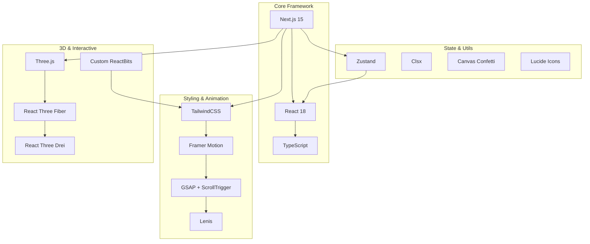
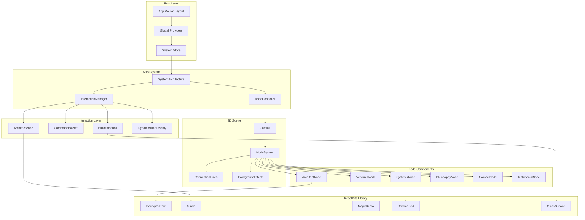
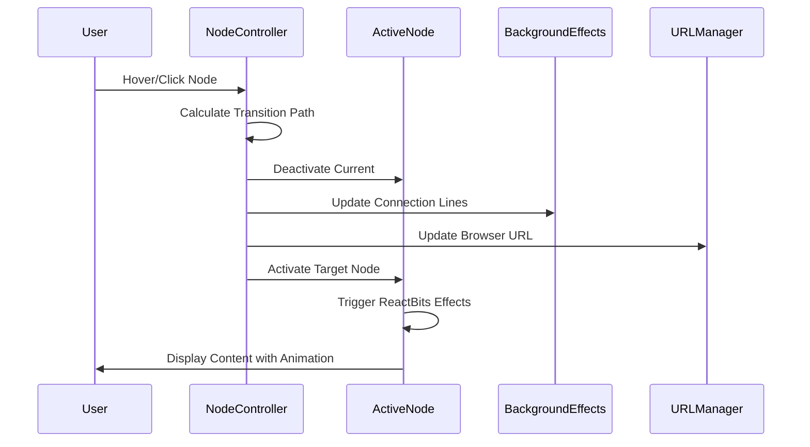
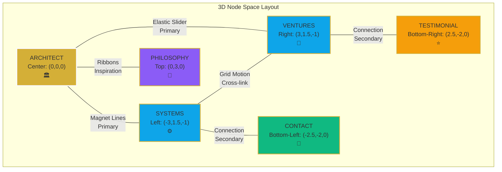
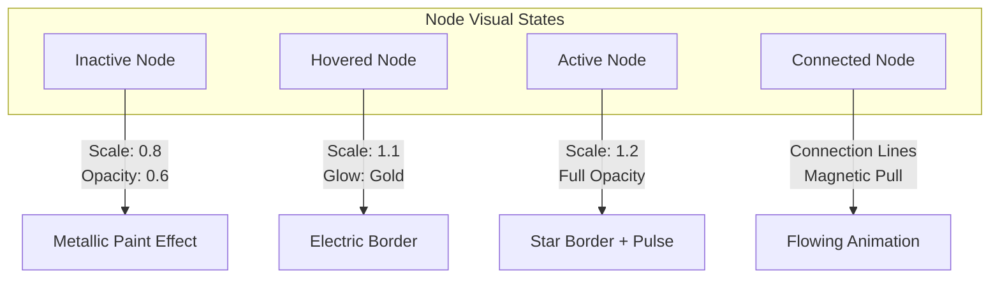

# Jai Samyukth Portfolio - System Architecture Redesign

## Overview

### Vision: "The Living Blueprint"
Transform the existing traditional portfolio into an interactive 3D system architecture visualization that demonstrates Jai Samyukth's role as a Software Architect through a living, breathing digital blueprint. The redesign shifts from linear content consumption to dynamic exploration of interconnected system nodes.

### Core Transformation
- **From**: Traditional scroll-based sections (Hero, About, Experience, Projects, Contact)
- **To**: Interactive 3D node-based system with real-time visualization
- **Purpose**: Portfolio becomes a demonstration of architectural thinking made visible

### Key Innovation Points
1. **System Node Navigation**: Replace sections with floating 3D nodes connected by dynamic pathways
2. **ReactBits Integration**: Advanced UI components for premium interactions
3. **Architect Mode**: Toggle showing the website's own architecture
4. **Command Palette**: VS Code-style navigation and interaction
5. **Interactive Sandbox**: "Build With Me" demo for visitor engagement

## Technology Stack & Dependencies

### Core Framework Evolution
```typescript
// Current Stack (Enhanced)
- Next.js 15 (App Router) - Upgraded from 14
- TypeScript 5.9+ 
- TailwindCSS 3.4+

// New Additions
- ReactBits Component Library (Full Suite)
- Three.js 0.160+ (3D Rendering)
- React Three Fiber 8.15+ (React Three.js Integration)
- React Three Drei 9.90+ (Three.js Utilities)
- Framer Motion 11.0+ (Animation Orchestration)
- Lenis 1.1+ (Smooth Scrolling)
- GSAP 3.12+ (Complex Animations)
```

### ReactBits Components Mapping
```typescript
interface ReactBitsComponents {
  text: ['Decrypted Text', 'Gradient Text', 'Shiny Text', 'Variable Proximity', 'Text Trail']
  backgrounds: ['Aurora', 'Lightning']
  interactions: ['Blob Cursor', 'Target Cursor', 'Splash Cursor', 'Click Spark']
  layouts: ['Magic Bento', 'Circular Gallery', 'Chroma Grid', 'Flowing Menu']
  effects: ['Metallic Paint', 'Electric Border', 'Glass Surface', 'Star Border']
  navigation: ['Dock', 'Pill Nav', 'Elastic Slider', 'Ribbons']
  animations: ['Scroll Reveal', 'Pixel Transition', 'Fade Content', 'Counter']
}
```

### Dependencies Architecture


## Component Architecture

### System Node Hierarchy


### Component Definition Strategy

#### SystemArchitecture (Root Component)
```typescript
interface SystemArchitectureProps {
  initialNode?: NodeType
  architectMode?: boolean
  children: React.ReactNode
}

// Responsibilities:
// - 3D scene setup and camera control
// - Node positioning and connection management
// - Global state management for active node
// - Background effect orchestration
// - Performance monitoring integration
```

#### NodeController (Navigation Hub)
```typescript
interface NodeControllerProps {
  nodes: NodeConfig[]
  activeNode: string
  onNodeChange: (nodeId: string) => void
  connectionStyle: 'elastic' | 'magnetic' | 'organic'
  transitionDuration: number
}

// Responsibilities:
// - Inter-node navigation logic
// - Connection line rendering with Three.js
// - Transition animations between nodes
// - Node activation/deactivation states
// - URL synchronization
```

#### Individual Node Components
```typescript
// Base Node Interface
interface BaseNodeProps {
  id: string
  position: Vector3
  isActive: boolean
  connectionsTo: string[]
  reactBitsComponents: ReactBitsComponent[]
  onActivate: (nodeId: string) => void
}

// Specialized Node Types:
// - ArchitectNode: Central hub with DecryptedText name reveal
// - SystemsNode: Technical skills with ChromaGrid interaction
// - VenturesNode: Projects with MagicBento layout
// - PhilosophyNode: Manifesto with VariableProximity text
// - ContactNode: Connection interface with Dock navigation
// - TestimonialNode: Social proof with GlassSurface cards
```

### Component Interaction Patterns

#### Navigation Flow


#### State Management Flow
```typescript
interface SystemState {
  // Navigation State
  activeNode: string
  previousNode: string
  navigationHistory: string[]
  isTransitioning: boolean
  
  // Interaction State
  architectMode: boolean
  commandPaletteOpen: boolean
  buildSandboxActive: boolean
  cursorMode: 'blob' | 'target' | 'splash'
  
  // Animation State
  globalAnimationsEnabled: boolean
  performanceMode: 'high' | 'medium' | 'low'
  activeAnimations: Map<string, AnimationInstance>
  
  // User Analytics
  visitTime: number
  interactionCount: number
  preferredNode: string
  hasSeenIntro: boolean
  
  // Performance Metrics
  fps: number
  memoryUsage: number
  nodeTransitionTime: number
}

// Context Providers:
// - SystemContext: Global system state with Zustand
// - AnimationContext: GSAP timeline coordination
// - InteractionContext: User behavior tracking
// - PerformanceContext: Real-time performance monitoring
```

## Routing & Navigation

### 3D Node Navigation System
Replace traditional routing with spatial navigation between floating nodes in 3D space.

#### Navigation Architecture
```typescript
interface NavigationNode {
  id: string
  position: [number, number, number] // 3D coordinates
  connections: string[]
  component: React.ComponentType
  animations: {
    enter: AnimationConfig
    exit: AnimationConfig
    hover: AnimationConfig
    idle: AnimationConfig
  }
  metadata: {
    title: string
    description: string
    keywords: string[]
  }
}

const NAVIGATION_NODES: NavigationNode[] = [
  {
    id: 'architect',
    position: [0, 0, 0], // Center hub
    connections: ['systems', 'ventures', 'philosophy'],
    component: ArchitectNode,
    animations: {
      enter: { scale: [0, 1], duration: 0.8, ease: 'back.out(1.7)' },
      exit: { scale: [1, 0.8], opacity: [1, 0.7], duration: 0.5 },
      hover: { glow: true, metallic: true, scale: 1.1 },
      idle: { bob: true, amplitude: 0.1, frequency: 0.5 }
    },
    metadata: {
      title: 'Jai Samyukth - Software Architect',
      description: 'Central hub showcasing architectural philosophy',
      keywords: ['architect', 'software', 'systems', 'design']
    }
  },
  {
    id: 'systems',
    position: [-3, 1.5, -1], // Left cluster
    connections: ['contact'],
    component: SystemsNode,
    animations: {
      enter: { scale: [0, 1], x: [-100, -3], duration: 1 },
      exit: { scale: [1, 0.9], opacity: [1, 0.8] },
      hover: { electricBorder: true, chromaShift: true },
      idle: { pulse: true, intensity: 0.2 }
    },
    metadata: {
      title: 'Technical Systems Architecture',
      description: 'Comprehensive technical skill matrix and expertise',
      keywords: ['skills', 'technology', 'architecture', 'expertise']
    }
  }
  // Additional nodes...
]
```

#### Spatial Relationship Map


#### URL Strategy with SEO
```typescript
// Maintain SEO-friendly URLs while supporting 3D navigation
const URL_MAPPING = {
  '/': 'architect',           // Landing on central node
  '/systems': 'systems',      // Direct access to systems node
  '/ventures': 'ventures',    // Projects and case studies
  '/philosophy': 'philosophy', // Manifesto and approach
  '/contact': 'contact',      // Contact interface
  '/testimonials': 'testimonial' // Social proof
}

// Enhanced URL management with metadata
const navigateToNode = (nodeId: string) => {
  const node = NAVIGATION_NODES.find(n => n.id === nodeId)
  if (!node) return
  
  // Update URL without page reload
  const url = nodeId === 'architect' ? '/' : `/${nodeId}`
  window.history.pushState({
    nodeId,
    timestamp: Date.now()
  }, node.metadata.title, url)
  
  // Update document title for SEO
  document.title = node.metadata.title
  
  // Update meta description
  const metaDesc = document.querySelector('meta[name="description"]')
  if (metaDesc) {
    metaDesc.setAttribute('content', node.metadata.description)
  }
  
  // Trigger node activation
  useSystemStore.getState().navigateToNode(nodeId)
}
```

### Advanced Navigation Features

#### Command Palette (Cmd+K) - Enhanced
```typescript
interface CommandPaletteAction {
  id: string
  label: string
  shortcut?: string
  action: () => void
  category: 'navigation' | 'tools' | 'contact' | 'easter-eggs' | 'performance'
  icon?: React.ComponentType
  description?: string
}

const COMMAND_ACTIONS: CommandPaletteAction[] = [
  // Navigation Commands
  {
    id: 'architect',
    label: 'Go to Architect Hub',
    shortcut: 'A',
    action: () => navigateToNode('architect'),
    category: 'navigation',
    icon: Building,
    description: 'Central hub with philosophy and overview'
  },
  {
    id: 'systems',
    label: 'View System Architecture',
    shortcut: 'S',
    action: () => navigateToNode('systems'),
    category: 'navigation',
    icon: Cpu,
    description: 'Technical skills and expertise matrix'
  },
  
  // Tool Commands
  {
    id: 'architect-mode',
    label: 'Toggle Architect Mode',
    shortcut: 'M',
    action: () => useSystemStore.getState().toggleArchitectMode(),
    category: 'tools',
    icon: Eye,
    description: 'Show component boundaries and system internals'
  },
  {
    id: 'performance-mode',
    label: 'Toggle Performance Monitor',
    shortcut: 'P',
    action: () => togglePerformanceMonitor(),
    category: 'performance',
    icon: Activity,
    description: 'Display real-time performance metrics'
  },
  
  // Contact Commands
  {
    id: 'download-resume',
    label: 'Download Resume',
    shortcut: 'R',
    action: () => downloadResume(),
    category: 'contact',
    icon: Download,
    description: 'Get latest CV in PDF format'
  },
  {
    id: 'schedule-call',
    label: 'Schedule Consultation',
    shortcut: 'C',
    action: () => openSchedulingModal(),
    category: 'contact',
    icon: Calendar,
    description: 'Book a technical consultation call'
  },
  
  // Easter Eggs
  {
    id: 'konami-code',
    label: 'Activate Matrix Mode',
    action: () => activateMatrixMode(),
    category: 'easter-eggs',
    icon: Zap,
    description: 'Something special happens...'
  }
]
```

## Styling Strategy

### Enhanced Design System
Evolution from current "Ghost Aesthetic" to "Architectural Blueprint" theme.

#### Color Palette Expansion
```css
:root {
  /* Primary Palette */
  --velvet-black: #0A0A0A;
  --burnished-gold: #D4AF37;
  --electric-blue: #0EA5E9;
  --crisp-white: #FAFAFA;
  
  /* Extended Palette */
  --gold-glow: rgba(212, 175, 55, 0.2);
  --blue-glow: rgba(14, 165, 233, 0.2);
  --node-active: rgba(212, 175, 55, 0.4);
  --connection-line: rgba(212, 175, 55, 0.6);
  
  /* Glass Effects */
  --glass-bg: rgba(255, 255, 255, 0.05);
  --glass-border: rgba(255, 255, 255, 0.1);
  --glass-backdrop: blur(10px);
}
```

#### Typography System
```css
/* Display Typography */
.font-display {
  font-family: 'Clash Display', 'Satoshi', sans-serif;
  font-weight: 600;
}

/* System Monospace */
.font-mono {
  font-family: 'JetBrains Mono', 'SF Mono', monospace;
}

/* Architectural Labels */
.font-blueprint {
  font-family: 'Satoshi', 'Inter', sans-serif;
  font-weight: 500;
  letter-spacing: 0.5px;
  text-transform: uppercase;
}
```

#### ReactBits Component Styling
```css
/* Custom ReactBits Overrides */
.reactbits-decrypted-text {
  --accent-color: var(--burnished-gold);
  --text-color: var(--crisp-white);
  animation-duration: 2s;
}

.reactbits-aurora {
  --aurora-primary: var(--velvet-black);
  --aurora-secondary: var(--burnished-gold);
  --aurora-tertiary: var(--electric-blue);
}

.reactbits-magic-bento {
  --grid-gap: 1.5rem;
  --border-color: var(--glass-border);
  --hover-glow: var(--gold-glow);
}
```

### Component-Specific Styling

#### Node Visual Hierarchy


## State Management

### Global State Architecture
```typescript
interface SystemGlobalState {
  // Navigation State
  navigation: {
    activeNode: string
    previousNode: string
    navigationHistory: string[]
    isTransitioning: boolean
  }
  
  // Interaction State
  interaction: {
    architectMode: boolean
    commandPaletteOpen: boolean
    buildSandboxActive: boolean
    cursorMode: 'blob' | 'target' | 'splash'
  }
  
  // Animation State
  animation: {
    globalAnimationsEnabled: boolean
    performanceMode: 'high' | 'medium' | 'low'
    activeAnimations: Map<string, AnimationInstance>
  }
  
  // User State
  user: {
    visitTime: number
    interactionCount: number
    preferredNode: string
    hasSeenIntro: boolean
  }
}
```

### State Management Pattern
```typescript
// Using Zustand for lightweight state management
import { create } from 'zustand'
import { subscribeWithSelector } from 'zustand/middleware'

interface SystemStore extends SystemGlobalState {
  // Actions
  navigateToNode: (nodeId: string) => void
  toggleArchitectMode: () => void
  setCommandPalette: (open: boolean) => void
  updatePerformanceMode: (mode: PerformanceMode) => void
}

export const useSystemStore = create<SystemStore>()(
  subscribeWithSelector((set, get) => ({
    // Initial state
    navigation: {
      activeNode: 'architect',
      previousNode: '',
      navigationHistory: ['architect'],
      isTransitioning: false
    },
    
    // Actions
    navigateToNode: (nodeId: string) => {
      const { navigation } = get()
      set({
        navigation: {
          ...navigation,
          previousNode: navigation.activeNode,
          activeNode: nodeId,
          navigationHistory: [...navigation.navigationHistory, nodeId],
          isTransitioning: true
        }
      })
    }
    // Additional actions...
  }))
)
```

### Animation State Coordination
```typescript
// Animation orchestration with Framer Motion
interface AnimationController {
  registerAnimation: (id: string, animation: AnimationInstance) => void
  sequenceAnimations: (animations: AnimationSequence[]) => Promise<void>
  pauseAll: () => void
  resumeAll: () => void
  cleanupCompleted: () => void
}

const useAnimationController = (): AnimationController => {
  const activeAnimations = useRef<Map<string, AnimationInstance>>(new Map())
  
  const registerAnimation = useCallback((id: string, animation: AnimationInstance) => {
    activeAnimations.current.set(id, animation)
  }, [])
  
  // Additional methods...
}
```

## API Integration Layer

### Contact System Enhancement
```typescript
interface ContactAPI {
  // Enhanced contact form with validation
  submitContact: (data: ContactFormData) => Promise<ContactResponse>
  
  // Command palette integration
  scheduleCall: (timeSlot: string) => Promise<CalendarResponse>
  
  // Real-time availability
  getAvailability: () => Promise<AvailabilityData>
}

interface ContactFormData {
  name: string
  email: string
  projectVision: string
  preferredChannel: 'email' | 'linkedin' | 'call'
  budget?: string
  timeline?: string
}
```

### Dynamic Content System
```typescript
interface ContentAPI {
  // Testimonials with real-time updates
  getTestimonials: () => Promise<Testimonial[]>
  
  // Project metrics (live data)
  getProjectMetrics: (projectId: string) => Promise<ProjectMetrics>
  
  // Skills evolution tracking
  getSkillsProgress: () => Promise<SkillProgressData>
}

// Integration with external APIs
const contentSources = {
  github: 'GitHub API for repository data',
  linkedin: 'LinkedIn API for recommendations',
  analytics: 'Custom analytics for user behavior'
}
```

### Performance Monitoring API
```typescript
interface PerformanceAPI {
  // Real-time performance tracking
  trackMetrics: (metrics: WebVitals) => void
  
  // Animation performance
  trackAnimationFrames: (frameData: FrameData) => void
  
  // User interaction analytics
  trackUserFlow: (flowData: UserFlowData) => void
}
```

## Testing Strategy

### Component Testing Framework
```typescript
// React Testing Library with custom utilities
import { render, screen, fireEvent } from '@testing-library/react'
import { SystemProvider } from '../contexts/SystemContext'

const renderWithSystemContext = (component: React.ReactElement) => {
  return render(
    <SystemProvider>
      {component}
    </SystemProvider>
  )
}

// Example test for node navigation
describe('NodeController', () => {
  test('navigates between nodes correctly', async () => {
    const { getByTestId } = renderWithSystemContext(<NodeController />)
    
    fireEvent.click(getByTestId('systems-node'))
    
    await waitFor(() => {
      expect(getByTestId('systems-node')).toHaveClass('active')
    })
  })
})
```

### 3D Scene Testing
```typescript
// Three.js scene testing with custom utilities
import { Canvas } from '@react-three/fiber'
import { renderHook } from '@testing-library/react'

const render3DScene = (scene: React.ReactElement) => {
  return render(
    <Canvas>
      {scene}
    </Canvas>
  )
}

// Test node positioning and connections
describe('3D Node System', () => {
  test('positions nodes correctly in 3D space', () => {
    const { result } = renderHook(() => useNodePositions())
    
    expect(result.current.architect.position).toEqual([0, 0, 0])
    expect(result.current.systems.position).toEqual([-200, 100, -50])
  })
})
```

### Performance Testing
```typescript
// Animation performance testing
describe('Animation Performance', () => {
  test('maintains 60fps during node transitions', async () => {
    const performanceObserver = new PerformanceObserver((list) => {
      const entries = list.getEntries()
      entries.forEach((entry) => {
        expect(entry.duration).toBeLessThan(16.67) // 60fps threshold
      })
    })
    
    performanceObserver.observe({ entryTypes: ['measure'] })
    
    // Trigger node transition
    fireEvent.click(getByTestId('ventures-node'))
    
    await waitFor(() => {
      expect(getByTestId('ventures-node')).toHaveClass('active')
    })
  })
})
```

### Integration Testing
```typescript
// End-to-end testing with Playwright
import { test, expect } from '@playwright/test'

test('complete user journey', async ({ page }) => {
  await page.goto('/')
  
  // Test initial load and intro sequence
  await expect(page.locator('[data-testid="decrypted-text"]')).toBeVisible()
  
  // Test node navigation
  await page.click('[data-testid="systems-node"]')
  await expect(page.locator('[data-testid="chroma-grid"]')).toBeVisible()
  
  // Test command palette
  await page.keyboard.press('Meta+K')
  await expect(page.locator('[data-testid="command-palette"]')).toBeVisible()
  
  // Test architect mode
  await page.click('[data-testid="architect-mode-toggle"]')
  await expect(page.locator('[data-testid="component-boundaries"]')).toBeVisible()
})
```

### Performance Benchmarks
```typescript
interface PerformanceTargets {
  LCP: 1.5 // Largest Contentful Paint (seconds)
  FID: 50  // First Input Delay (milliseconds)
  CLS: 0.05 // Cumulative Layout Shift
  TTI: 2.5  // Time to Interactive (seconds)
  
  // Custom metrics
  nodeTransitionTime: 300 // milliseconds
  animationFrameDrops: 0  // maximum dropped frames
  memoryUsage: 50 // MB maximum
}
```

## Advanced Features Architecture

### Architect Mode Implementation
```typescript
interface ArchitectModeConfig {
  enabled: boolean
  showComponentBoundaries: boolean
  showDataFlow: boolean
  showPerformanceMetrics: boolean
  showStateTree: boolean
}

const ArchitectModeOverlay: React.FC = () => {
  const { architectMode } = useSystemStore()
  
  if (!architectMode) return null
  
  return (
    <div className="architect-mode-overlay">
      <ComponentBoundaries />
      <DataFlowVisualizer />
      <PerformanceMonitor />
      <StateTreeViewer />
    </div>
  )
}
```

### Build With Me Sandbox
```typescript
interface BuildSandboxProps {
  onIdeaSubmit: (idea: BusinessIdea) => void
  onArchitectureGenerate: (architecture: SystemArchitecture) => void
}

const BuildSandbox: React.FC<BuildSandboxProps> = () => {
  return (
    <div className="build-sandbox">
      <IdeaInput />
      <ArchitectureGenerator />
      <SystemVisualization />
      <CTAButton text="Let's build your real system" />
    </div>
  )
}
```


